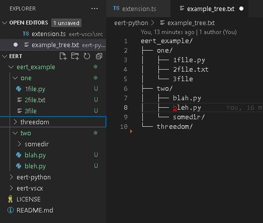

# eert - inverse tree utility

This tool essentially inverts what /usr/bin/tree -F does. It creates a real directory structure on your filesystem based on an ascii line-art tree. 

## Why?
Let's say a README shows you a tree listing, suggesting you create the same. Or an architecture/requirements document does similarly. 

Or (as was my impetus for creating this) an LLM presents you with an example structure when you ask it to look at your code and suggest a sensible grouping of the classes within your single file into some nymber of seperate files for packaging in a library you plan to make public. 

Sure, you could manually mkdir and touch files, or you could slowly watch it come into existence as you refactor your code into multiple directories and files, bu if you're like me, you want to see it on your filesystem *now* and make changes and piecemeal refactor bits here and there, so you'd like to have the structure already exist, even as empty files. (And of course, the ability to use a source of truth diagram in the form of a text art directory tree without the potential for fatfingering or overlooking something when creating a real layout on a real filesystem is an obvious plus.)

## What? 
### Included is a Python tool that takes stdin and does the needful. for example 
```bash
git clone https://github.com/scottvr/eert/
cd eert/python
# copy a structure (but not file contents) from some example directory:
tree -F /home/user/example | python eert.py
# or from a file copied from a chat, document, etc:
$ mkdir test && cd test
$ tree -F
./

0 directories, 0 files
$ python ../eert.py < ../example_tree.txt
$ tree -F
./
└── eert_example/
    ├── one/
    │   ├── 1file.py*
    │   ├── 2file.txt*
    │   └── 3file/
    ├── threedom/
    └── two/
        ├── blah.py*
        ├── bleh.py*
        └── somedir/

7 directories, 4 files
```

### Included also is a vscode extension that takes highlighted tree-format text, and creates a copy of the directory structure represented by it
see the eert-vscx/ subdirectory. It has yet to be packaged so if you want to run it, open extension.ts within vscode and press F5. I'll get around to bundling it up eventually.

Here's an example of usage within vscode :


